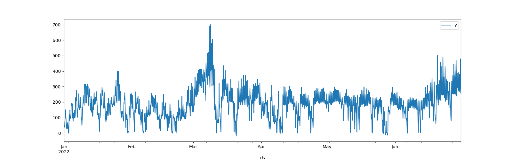

# Energy price forecasting 

Time series day ahead public market auction price forecasting.

### Dataset 
Hourly electicity prices from public european energy market over a 10 month period time window.

Data sources: 
- [https://www.smard.de](https://www.smard.de) (Bundesnetzagentur) 
- [https://transparency.entsoe.eu](https://transparency.entsoe.eu) 

Download as .csv file in various time resolutions.

## EDA 

### Tabular columns overview
Available dataset columns are named are as follows.

- MTU (CET/CEST) -> Time intervals [FROM, TO] in UTC+1 timezone 
- Day-ahead Price [EUR/MWh] -> Target price column to be predicted 
- Currency -> Price unit Euro (while constant, assumed to be irrelevant for modeling) 
- BZN|DE-LU -> Bidding zone Germany/Luxembourg, (irrelevant for modeling) 

### Time series raw data

There can be density change spotted in March in the raw datas line plot.

### Sampling distribution
To investigate if there are more data points from March onwards the aggregated data point count is shown.

### Data gaps

There is still a day with only 23 hours. 

### Hourly sampling completeness
After preprocessing and data cleansing, the gaps are interpolated and all days hourly samples are complete.

## Forecasting 
__Model setup:__
- Initial window size: 7 days 
- Horizon: 2 hours 
- Period: 6 hours 

Figure legend: 
- Historical observations (black dots) 
- Confidence interval (light blue band) 
- Predictions (blue dense line) 
- Threshold limit (dashed line) 

### Cross validation

__Metrics__

MAE: 55.70 

RMSE: 74.08 

__Interpretation__

MAE and RSME are below the pricings standard deviation of 90.656821, which means they are reasonable, but at the same time the difference is not very big. Hence the model did derive valuable information from the data, but it can be assumed that there is quite some potential with dataset preprocessing and model selection and configuration. Also the models parameters need more adjustment.

# Optimization Approach

Task: Buy energy cheap and store in batteries to sell at high prices.

### Problem formalization 

Charging speed at time t: $c_t$

__Battery constraints__ 

Total  capacity: $0 <= SOC_t <= 1MWh$

Charging speed: $-1 <= c_t <= 1MWh$

__Trading actions__ 

$c_t > 0 → $ Charging/Buy

$c_t = 0 → $ Idle/Hold

$c_t < 0 → $ Discharging/Sell

__State update__ $ SOC_{t+1} = SOC_t + c_t$

__Optimizable cost function__ $max ∑_t = price_t * c_t$

# Approache comparison

Historic prices profit: 21616.323853726

Predicted prices profit: <TODO fix model and recalculate>

Prediction vs historic price strategy difference: <TODO show difference>

