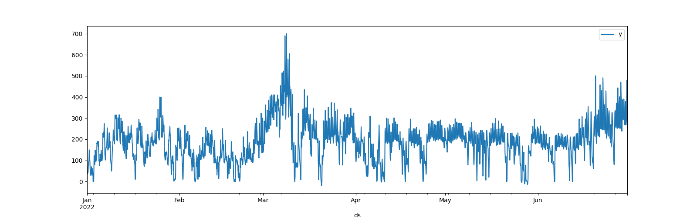
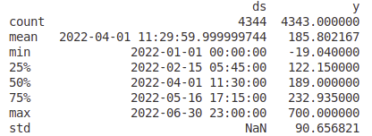
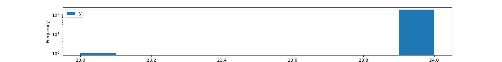
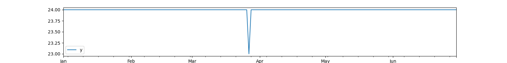
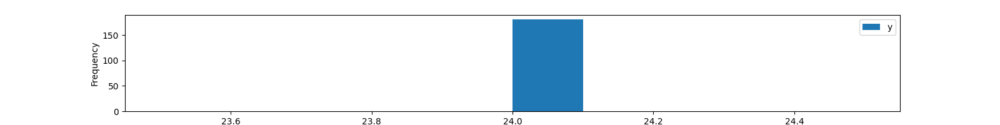
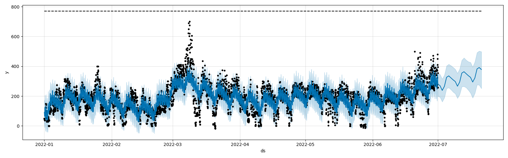
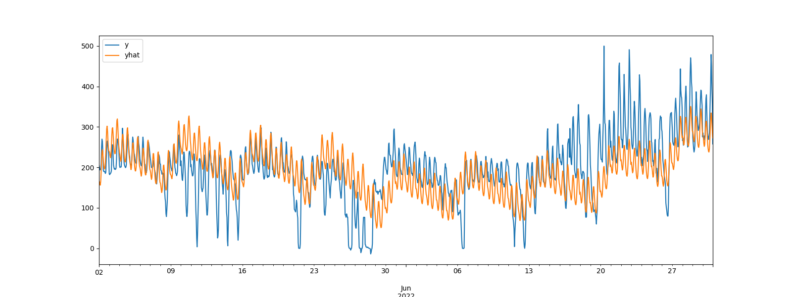
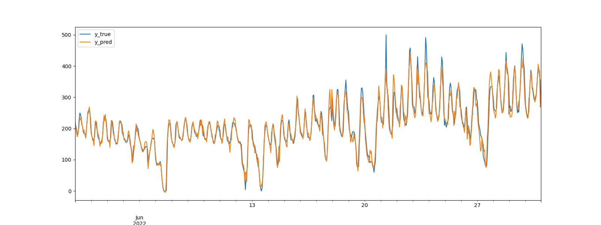
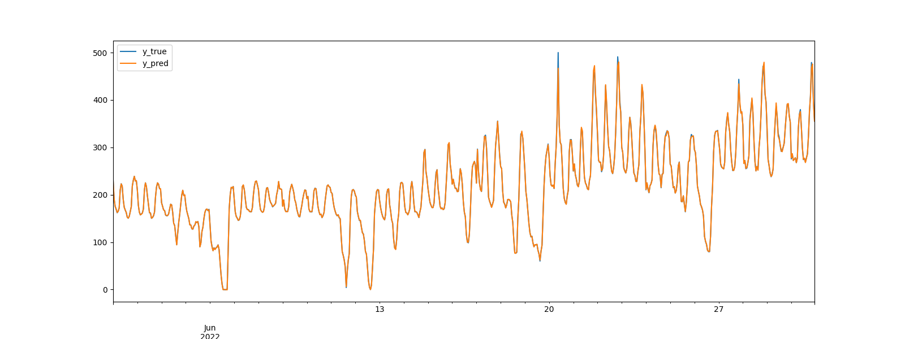

# Energy Price Forecasting 

Time series day ahead public market auction price forecasting.

### Dataset 
Hourly electicity prices from public european energy market over a 6 month period time window.

Data sources: 
- [https://www.smard.de](https://www.smard.de) (Bundesnetzagentur) 
- [https://transparency.entsoe.eu](https://transparency.entsoe.eu) 

Download as .csv file in various time resolutions.

## EDA 

### Table annotations 
Available dataset columns names.

- MTU (CET/CEST) -> Time intervals [FROM, TO] in UTC+1 timezone 
- Day-ahead Price [EUR/MWh] -> Target price column to be predicted 
- Currency -> Price unit Euro (irrelevant for modeling) 
- BZN|DE-LU -> Bidding zone Germany/Luxembourg 

---

### Market price raw data

_Y [Price in €/MWh]_

- Assumend density pattern change in March in the raw data 
- Large outlier in early March 

### Time series statistics

_ds: Time | y: Price_

### Sample distribution per day

_(Log) Price samples per day historgram_

Gap localization over time.

_Samples count per day_

Valid data shape confirmation after cleansing and interpolation.

_Price samples per day historgram_

## Forecast model (1. Prophet) 
__POC parametrization__ 
- Initial window size in days (120) $\rightarrow$ training window (the bigger the better) 
- Horizon in hours $\rightarrow$ prediction step size (how far to predict into the future) 
- Period in hours $\rightarrow$ number of prediction steps (how often to make predictions) 
 
_Y [Price in €/MWh] over time_

Legend: 
- Historical observations (black dots) 
- Confidence interval (light blue band) 
- Predictions (blue dense line) 
- Upper threshold limit (dashed black line) 

TODO adjust model parameters for improved results.

### Cross validation
Time series cross validation is used to measure the forecast error using historical data. This is done by selecting cutoff points in the history, and for each of them fitting the model using data only up to that cutoff point. The forecasted values (_yhat_) are compared to the actual (_y_) values.

 
_Prediction & observations over time for daily forecast horizon [Price in €/MWh]_

__Evaluation metrics__
| Experiment   | Pred. Period | Pred. Horizon |      MAE     |     RMSE     |
| ------------ | ------------ | ------------- | ------------ | ------------ |
|  Next hour   |       1      |       1       |     47.66    |      61.33   |
|  Next day    |       24     |       24      |     50.09    |      64.45   |

Metrics are below the pricings standard deviation of 90.656821, which means they are reasonable, but error metrics are still at quite high level. Hence the model did derive valuable information from the data, but it can be assumed that there is quite some potential left with dataset preprocessing and model selection. And most importantly the models parameters (e.g. sampling strategy) are just chosen for quick experimentation but not for optimal results and need more adjustment.

#### Review 

Prophet model for time series forecasting is exhausting its capability to handle high frequency, volatile and spiky (non-linear and irregular) patterns from external unkown factors in the data. Alternative modeling approaches like tree based classical models or TemporalFusion Transformers might suit the problem better and achieve higher performance. 

## Forecast model (2. XGBoost) 
Slicing data into 24h long samples manually. 

### Cross validation
Test set size of 696 June samples (deducting samples from gap between cross validation splits).
Two scenarios of hourly and one day ahead forecast horizons.

 
_Prediction & observations for daily forecast horizon [Price in €/MWh]_

 
_Prediction & observations for hourly forecast horizon [Price in €/MWh]_

__Evaluation metrics__
| Experiment   | Pred. Period | Pred. Horizon |      MAE     |     RMSE     |
| ------------ | ------------ | ------------- | ------------ | ------------ |
|  Next hour   |       1      |       1       |     1.05     |      2.68    | 
|  Next day    |       24     |       24      |     15.21    |      21.94   |

#### Review 
The tree based model achieves significantly smaller error metrics on the evaluation sets in both scenarios and handles non saisonale spiky patterns better.

## Optimization Approach

__Task:__ Buy energy at cheap prices and store in batteries, to sell at future higher prices.

### Problem formalization 

Charging speed at time t: $c_t$

__Battery constraints__ 

Total  capacity: $0 <= SOC_t <= 1MWh$

Charging speed: $-1 <= c_t <= 1MWh$

__Trading actions__ 

$`c_t > 0 → `$ Charging/Buy 

$`c_t = 0 → `$ Idle/Hold 

$`c_t < 0 → `$ Discharging/Sell 

__State update__ $`SOC_{t+1} = SOC_t + c_t`$

__Optimizable cost function__ $`max ∑_t = price_t * c_t`$

<!-- ## Approach comparison

Historic prices profit: 21616.323853726

Predicted prices profit: <TODO fix model and recalculate> 

Prediction vs historic price strategy difference: <TODO show difference> -->

