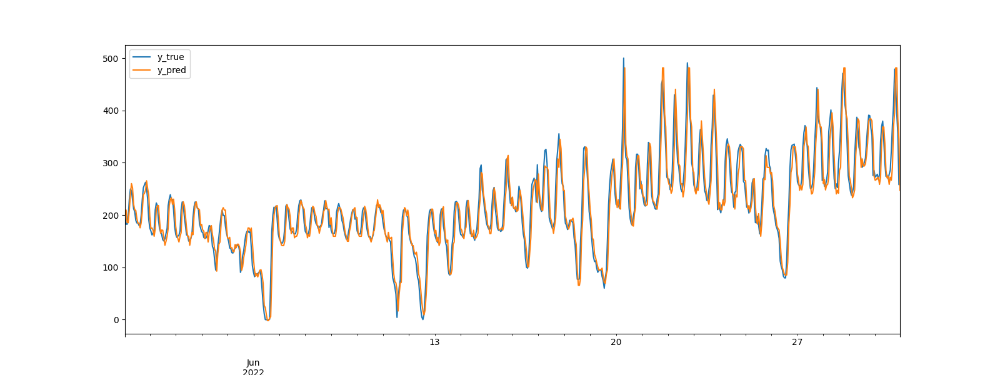
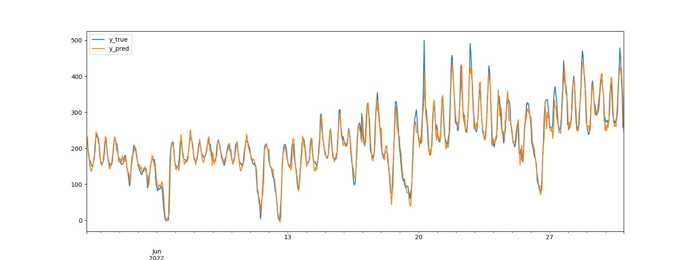

# Energy Price Forecasting 
 
 


Time series public market auction price forecasting. Comparing different prediction horizon scenarios, prediction models and contribution of feature engineering.

#### Results overview

|   Model  | Art. Feat |  Period  |   Horizon |    MAE   |   RMSE   |
| -------- | --------- | -------- | --------- | -------- | -------- |
|  Prohpet |    No     |     1    |     1     |   47.66  |    61.33 |
|  Prohpet |    No     |     24   |     24    |   50.09  |   64.45  |
|  XGBoost |    No     |     1    |     1     |   21.08  |  29.37   |
|  XGBoost |    No     |     24   |     24    |     |  |
|  XGBoost |    yes    |     1    |     1     |   17.21  |    25.54 |
|  XGBoost |    yes    |     6    |     1     |     |     |
|  XGBoost |    yes    |     12   |     1     |   15.59  |    21.73 |
|  XGBoost |    yes    |     24   |     1     |   16.65  |    23.35 |
|  XGBoost |    yes    |     1    |     24    |   46.32  |    63.47 |
|  XGBoost |    yes    |     6    |     24    |   47.19  |    64.21 |
|  XGBoost |    yes    |     12   |     24    |   51.25  |    64.98 |
|  XGBoost |    yes    |     24   |     24    |   49.48  |    65.98 |


### Quick start 
```
git clone ...
cd price_forecasting
poetry install
poetry shell
(venv) python prophet_forecasting.py   # evaluates Prophet model
(venv) python tree_forecasting.py      # evaluates XGBoost model
(venv) python optimization.py          # evaluates optimization strategy
```


## Dataset 
Hourly electicity prices from public european energy market over a 6 month period time window.

Data sources: 
- [https://www.smard.de](https://www.smard.de) (Bundesnetzagentur) 
- [https://transparency.entsoe.eu](https://transparency.entsoe.eu) 

Download as .csv file in various time resolutions.

## EDA 

### Table annotations 
Available dataset columns names.

- MTU (CET/CEST) $\rightarrow$ Time intervals [FROM, TO] in UTC+1 timezone 
- Day-ahead Price [EUR/MWh] $\rightarrow$ Target price column to be predicted 
- Currency $\rightarrow$ Price unit Euro (irrelevant for modeling) 
- BZN|DE-LU $\rightarrow$ Bidding zone Germany/Luxembourg 

---

### Market price raw data 
Electricity price of the public auction market.


_Y Price [€/MWh] & ds [hour]_

__Observations__ 
- Noisy short term variability, next to long term repetitive cyclic patterns 
- External factors seems to cause unusual large outlier in early March 


### Time series statistics


_ds: Time | y: Price_


### Preprocessing daily sample distribution 


_(Log) Price samples per day historgram_

Gap localization over time.

_Samples count per day_

Data cleansing by interpolation over small time step gaps for a clean training dataset.

#### Feature engineering 
Two situations with regards to the feature dimensions have been compared for the XGBoost. Raw time series only as feature input, in constrast to extracting additional common metrics from the price.


_Features over time_


## Forecast model (1. Prophet) 
__POC parametrization__ 
- Initial window size in days (120) $\rightarrow$ training window (the bigger the better) 
- Horizon in hours $\rightarrow$ prediction step size (how far to predict into the future) 
- Period in hours $\rightarrow$ number of prediction steps (how often to make predictions) 
 
_Y [Price in €/MWh] over time_

Legend: 
- Historical observations (black dots) 
- Confidence interval (light blue band) 
- Predictions (blue dense line) 
- Upper threshold limit (dashed black line) 

### Test set evaluation 
Time series cross validation is used to measure the forecast error using historical data. This is done by selecting cutoff points in the history, and for each of them fitting the model using data only up to that cutoff point. The forecasted values (_yhat_) are compared to the actual (_y_) values.

 
_Prediction & observations over time for daily forecast horizon [Price in €/MWh]_

Metrics are below the pricings standard deviation of 90.656821, which means they are reasonable, but error metrics are still at quite high level. Hence the model did derive valuable information from the data, but it can be assumed that there is quite some potential left with dataset preprocessing and model selection. And most importantly the models parameters (e.g. sampling strategy) are just chosen for quick experimentation but not for optimal results and need more adjustment.


#### Review 

Prophet model for time series forecasting is exhausting its capability to handle high frequency, volatile and irregular patterns from external unkown factors in the data. Alternative modeling approaches like tree based classical models or TimesNet might suit the problem better and achieve higher performance.


## Forecast model (2. XGBoost) 
Tree based boosting model for time series forecasting. 

### Test set evaluation  
Test set size of 696 June samples (deducting samples from gap between cross validation splits).
Two scenarios of hourly and one day ahead forecast horizons.

 
_Prediction & observations for daily forecast horizon, no artifical features [Price in €/MWh]_

 
_Prediction & observations for hourly forecast horizon, no artifical features [Price in €/MWh]_

__XGBoost with extended input feature dimensions__
 
_Prediction & observations for daily forecast horizon, artifical features added [Price in €/MWh]_

 
_Prediction & observations for hourly forecast horizon, artifical features added [Price in €/MWh]_


#### Review 
The tree based model achieves significantly smaller error metrics on the evaluation sets for the short term prediction scenario and handles non saisonale spiky patterns better. While the tree based model outperforms the prohpet model on long term predictions on a smaller distance. Data set extension adding artifical feature dimensions, does only contribute benefitial to the prediction accuracy in the short horizon scenario.


## Optimization Strategy

__Task:__ Buy energy at cheap prices and store in batteries, to sell at future higher prices.

### Problem formalization 

Charging speed at time t: $c_t$

__Battery constraints__ 

Total  capacity: $0 <= SOC_t <= 1MWh$

Charging speed: $-1 <= c_t <= 1MWh$


__Trading actions__ 

$`c_t > 0 → `$ Charging/Buy 

$`c_t = 0 → `$ Idle/Hold 

$`c_t < 0 → `$ Discharging/Sell 


__State update__ $`SOC_{t+1} = SOC_t + c_t`$

__Optimizable cost function__ $`max ∑_t = price_t * c_t`$


<!-- ## Approach comparison

Historic prices profit: 21616.323853726

Predicted prices profit: <TODO fix model and recalculate> 

Prediction vs historic price strategy difference: <TODO show difference> -->

